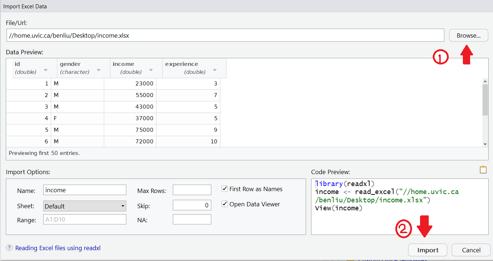

 
# Getting Started for Math & Engineering - Data types and Basic commands

If you and your group have any questions or get stuck as you work through this in-class exercise, please ask the instructor for assistance.  Have fun!

1. **Getting familiar with RStudio** 
- Open RStudio and get familiar with the interface by finding 4 windows
    - In the console window (left), type <code>getwd()</code> to display the current working directory.
    - This directory should contain all the datasets you plan on using.
    - Set the working directory to your preferred location using. For e.g.: <code>setwd("c:/Users/rmccue/Download")</code>
- Type: <code>help(mean)</code> to get help about the mean function & see use case examples. 

2. **Data types and basic commands**
- To start with, click the ‘File’ on the menu and then create a new R script.
- Variables: “ <- ”(read as get) and “ =” can be used to assign a value to a variable. Type <code>v1<-1</code>  and <code>v2=2</code>  in the **script window** and press **cmd + enter** for MacOS or **control +** enter for Windows to execute the line. 
- Characters: Type <code>c1='c'</code>  and <code>c2='good'</code>.
- Logical or boolean values: Type <code>b1=TRUE</code> and <code>b2=T</code>. T is short for TRUE and F is short for FALSE.
- Vectors: Type <code>x1=c(1,2,3)</code> and <code>x2=1:3</code> ( c stands for combine / concatenate). Try the following steps in the picture to explore other ways of building vectors.
- 
- Matrix: Type <code>m1=matrix(data = c(1,2,3,4,5,6), nrow=2)</code> and <code>m2=matrix(data = c(1,2,3,4,5,6)</code>, <code>ncol=2, byrow=TRUE)</code>. Byrow is set to FALSE by default which means the matrix is filled by columns. Double click on **m1** and **m2** in **Environment window** to see their values. Try the following steps in the picture to explore how to access elements in a matrix.
- Display all objects created (by assigning values) by typing the following into the **console window**: <code>ls()</code> (Please note that “l” is the letter)
- Save your script by clicking on the top menu bar: “File” -> “Save”
- Remove the “m1” object by typing in the console: <code>rm(m1)</code>
- Remove all the objects by typing the following in the console: <code>rm(list=ls())</code>

3. **Read or Import an Excel data file into R-Studio**
- [Download this Excel file](docs/income.xlsx){:target="_blank"}
- Please take note of where the income.csv file is saved (usually in a “downloads” or “desktop” folder).
- Import the dataset by clicking “File -> Import dataset -> From Excel” and click “Yes” to install the “readxl” package

- Click “Browse” to find the excel file and click “Import”
- 
- List the whole dataset in the console: **income** because income is the name of the dataset you imported.
- List the objects contained in your workspace in the console: <code>ls()</code>
- List the variables contained in the data frame in the console: <code>names(income)</code>
- List the variable “**experience**” in the console: <code>income$experience</code>
- Attach your data frame in the console (so you don’t have to type the name of the dataset when calling the variables contained in the dataset):
    - <code>attach(income)</code>
    -   
    - List all the values for the variable “**experience**” by typing directly into the console: <code>**experience**</code>
! [Demonstration of step 3](images/rstudio-basics-08.gif)
- Calculate the descriptive statistics for the income dataset in the console: <code>summary(income)</code>

[NEXT STEP: Tidyverse and Data Manipulation](tidyverse-data.html){: .btn .btn-blue }
